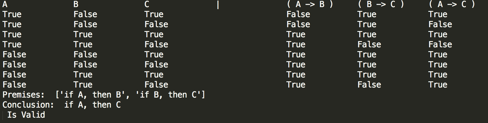
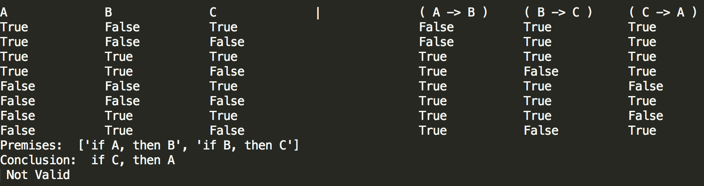

# Truth-table

## Summary
A python code that will create a **truth table** and **check validity** for an argument (a set of statements which consists of premises and a conclusion) based on propositional logic.

## Demonstration

